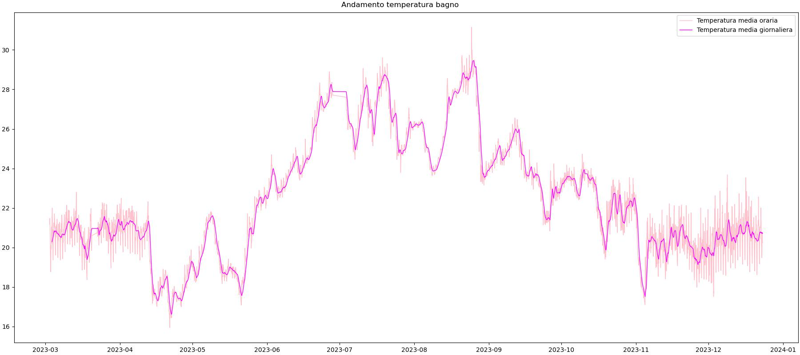

# The sensor project
L'anno scorso ho comprato dei meravigliosi igrometri di una non meglio identificata marca cinese, [Oria](https://www.amazon.it/gp/product/B08GKB5D1M/ref=ppx_yo_dt_b_asin_title_o02_s00?ie=UTF8&psc=1).

Devo dire che per il prezzo funzionano bene, semplici da utilizzare ed esteticamente piacevoli.

Ne ho presi sei e li ho utilizzati per monitorare la temperatura ambientale in alcune stanze di casa mia.

## Business case
Principalmente mi interessava sperimentare nell'implementazione di procedure ETL di Estrazione Traduzione e Load.

Secondariamente volevo vedere quanto potessero differire le temperature rilevate all'interno rispetto a quelle rilevate sui terrazzi.

## Preparazione dei dati
Gli igrometri Oria rilevano temperatura (°C) e umidità relativa (%) ogni 10 minuti.
Li ho utilizzati da Marzo a Dicembre 2023.

Il funzionamento non era chiarissimo, le istruzioni erano in cinese e il trasferimento delle informazioni avviene tramite app sul telefono via bluetooth con una sincronizzazione non molto ben studiata.

Sintesi: **i dati non sono di qualità**, a tratti mancanti per via di iniziali problemi con le batterie dei dispositivi.

## Execution
### ETL
L'app forniva appunto una scomodissima funzione di export in csv che potevi poi mandare alla email.
Ho sviluppato una funzione di Estrazione Traduzione e Load dei dati in file di output csv; sfrutto librerie Pandas, Datetime e Glob per l'accesso ai dati su disco in base a parametri definiti.

La [funzione ETL](./etl_function.py) cicla sopra i file in cartella contenente csv ottenuti da igrometri, estrae i dati, concatena i dataframe, modifica nomi, tipi e ordine colonne ed esporta un csv.

* Ho importato i csv su dataframe Pandas sfruttando libreria Glob
* Ho modificato i dtypes per avere:
    * Temperatura: float64 
    * Umidità: float64
    * Data: datetime64[ns]
* Creo file di log ad ogni passaggio
* Esporto le informaizoni in file .csv
* Matplotlib per plottare i dati

### Analisi dei dati
Ho utilizzato principalmente dati ottenuti tramite *moving average*, essendo infatti dati puntuali ogni 10 minuti ho trovato più indicato sintetizzarli in una media mobile differente a seconda del tipo di analisi - di solito media mobile di 1 ora, 12 ore e 24 ore.

## Grafici
### Temperatura giornaliera delle stanze
* Media mobile 1 giorno
* Tutte le stanze in grafico a linea
* *x = tempo, y = temperatura °C*

### Temperatura giornaliera delle stanze
* Media mobile 1 giorno
* Tutte le stanze in grafici multipli
* Messa a confronto con la temperatura media di tutte le stanze
* *x = tempo, y = temperatura °C*

**Osservazione**: non ha troppo senso mettere a media l'esterno con l'interno, però risulta evidente che i balconi sono quelli che si distaccano di più dalla media.

### Percentuale di umidità giornaliera delle stanze
* Media mobile 1 giorno
* Tutte le stanze in grafici multipli
* Messa a confronto con la percentuali medie di tutte le stanze
* *x = tempo, y = umidità %*

### Differenza tra interno ed esterno nella variabilità delle temperature ogni 12 ore
* Media mobile 1 ora / Media mobile 12 ore
* Interno (soggiorno), esterno (balcone est)
* *x = tempo, y = percentuale di variazione*

**Osservazione**: è ovvio, ma cmq interessante visualizzare come l'escursione di temperatura sia maggiore all'esterno rispetto che all'interno.

### Andamento temperature ogni 12 ore, interno ed esterno
* Media mobile 12 ore
* Interno (soggiorno), esterno (balcone est)
* *x = tempo, y = temperatura °C*

### Andamento temperature stanza bagno
* Media mobile 24 ore
* Media mobile 1 ora
* *x = tempo, y = temperatura °C*

### Calendar heatmap
Con [Tableau](https://public.tableau.com/views/sensor-project/TempCdashboard?:language=en-US&publish=yes&:display_count=n&:origin=viz_share_link) ho impostato una calendar heatmap delle varie stanze per vedere la distribuzione delle temperature medie nelle varie stanze durante l'anno.

#### Media mensile

#### Media mensile per giorno

